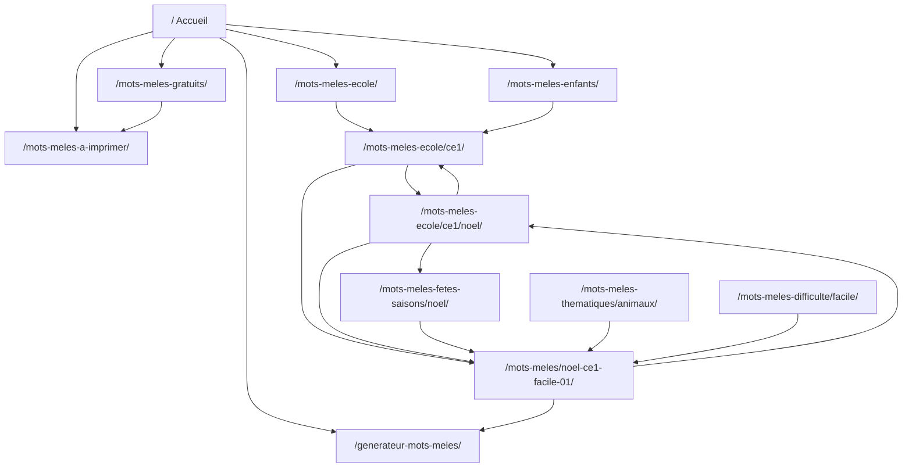
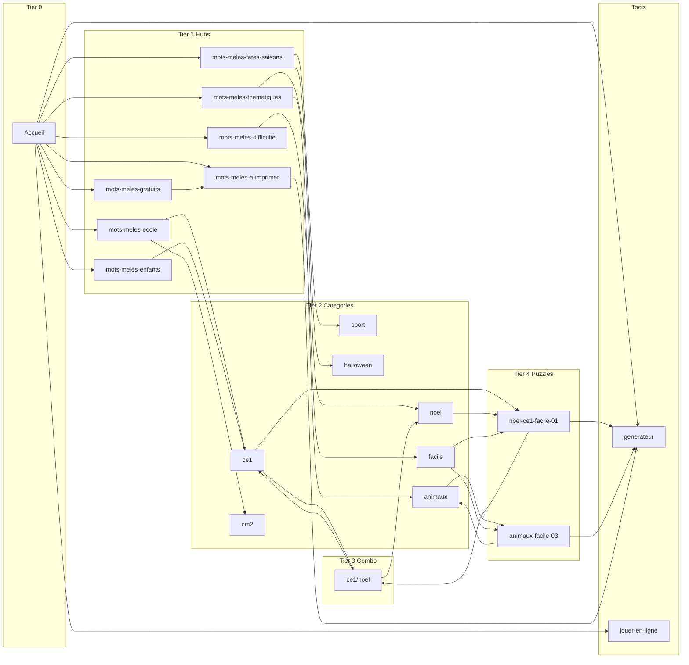

# Phase C — Pages, Routes & Programmatic SEO Architecture

**Status:** Planning only — awaiting approval before implementation  
**Scope:** Category pages · Puzzle pages · DB seed · Breadcrumbs · Internal linking · Metadata · Sitemaps · Schema  
**Inputs:** `PRD_Mots_Meles.md` · `IMPLEMENTATION_BLUEPRINT.md` · `style-guide.html` · topical map (25 clusters)  
**Prerequisites (done):** Phase A (DB schema + reference seed) · Phase B (puzzle engine + validation)

> **Note on topical map:** `topical_map_mots_meles.xlsx` was not present in the repository at planning time. The 25 cluster IDs below are reconstructed from PRD Sections 4–8, explicit cluster references (`GRADE_LEVEL`, `SEAS_OTHER`, `TOPIC`, `EDU_BLOG`, etc.), and the 6-silo architecture. When the xlsx is added to the repo, run a diff against Section 10 and adjust slug mappings only — route architecture stays unchanged.

---

## Executive summary

Phase C turns the database and puzzle engine into **indexable, interlinked pages**. One `CategoryTemplate` and one `PuzzleTemplate` serve all programmatic routes; paths are resolved from `Category.type` + relations, never hard-coded in page files. Publication is gated by puzzle count (`minPuzzleThreshold`, default 4) with automatic `noindex` below threshold.

**Phase C deliverables (implementation, not this doc):**
- `lib/seo/` route resolver, metadata, breadcrumbs, linking, related puzzles
- `CategoryTemplate` + `PuzzleTemplate` (RSC-first, style-guide tokens)
- App routes per Blueprint Section 1
- Seed: `categories` + ~100–150 `puzzles` + `category_puzzles`
- Sitemap v1 + schema JSON-LD on category/puzzle pages
- CI script: link-graph depth ≤ 3, zero orphans among published pages

---

## 1. Final route architecture

### 1.1 Principles

| Rule | Source |
|------|--------|
| **DB-driven paths** | Category slug + type + FKs → canonical URL via `resolveCategoryPath()` |
| **Single template per page type** | All category routes render `CategoryTemplate`; combo ≠ separate component |
| **Flat puzzle namespace** | `/mots-meles/{puzzle-slug}/` always; M:N via `category_puzzles` |
| **Trailing slash** | All public URLs end with `/` (Next.js `trailingSlash: true`) |
| **Depth ≤ 3 clicks** | Accueil → hub/catégorie → puzzle (combo = 3 clicks) |
| **ISR** | `revalidate: 3600` + on-demand via `/api/revalidate` webhook |
| **Noindex gates** | Search, generator results, categories below threshold, pagination ≥2 (conditional) |

### 1.2 Route resolution model

Categories do **not** store full paths in DB. A central resolver maps `Category` → path:

```
resolveCategoryPath(category) → string

CategoryType + relations → path template:

HUB_GRATUITS      → /mots-meles-gratuits/
HUB_IMPRIMER      → /mots-meles-a-imprimer/
HUB_ECOLE         → /mots-meles-ecole/
HUB_FETES         → /mots-meles-fetes-saisons/
HUB_THEMATIQUES   → /mots-meles-thematiques/
HUB_DIFFICULTE    → /mots-meles-difficulte/
HUB_PRESSE        → /mots-meles-journaux-magazines/
GRADE             → /mots-meles-ecole/{grade.slug}/
THEME             → /mots-meles-thematiques/{theme.slug}/
SEASONAL          → /mots-meles-fetes-saisons/{theme.slug}/
DIFFICULTY        → /mots-meles-difficulte/{difficulty.slug}/
AUDIENCE          → /mots-meles-{audienceSlug}/     (enfants|adultes|seniors)
COMBO             → /mots-meles-ecole/{grade.slug}/{theme.slug}/
PRESS_BRAND       → /mots-meles-journaux-magazines/{pressBrand.slug}/
STATIC_ARTICLE    → fixed paths (pedagogie, personnages, ressources, etc.)
```

**New seed convention:** Phase C adds `Category` rows for each hub/pillar with a dedicated `slug` (e.g. `hub-ecole`, `hub-thematiques`) and `type` aligned to resolver. Hubs are parent of leaf categories via `parentCategoryId`.

Puzzle path:

```
resolvePuzzlePath(puzzle) → /mots-meles/{puzzle.slug}/
```

### 1.3 App Router file mapping

```
app/
├── page.tsx                                    # Accueil (HomeTemplate — exists)
├── layout.tsx                                  # Header, Footer, MobileBottomNav
├── robots.ts
├── sitemap.ts                                  # Index → child sitemaps
│
├── mots-meles-gratuits/page.tsx                # StaticCategoryPage slug=hub-gratuits
├── mots-meles-a-imprimer/page.tsx
├── mots-meles-enfants/page.tsx
├── mots-meles-adultes/page.tsx
├── mots-meles-seniors/page.tsx
├── mots-meles-pedagogie/page.tsx               # StaticArticleTemplate
├── mots-meles-personnages/page.tsx
├── application-mots-meles/page.tsx
├── solutions-regles-mots-meles/page.tsx
├── jeux-magazines-mots-meles/page.tsx
├── ressources-enseignants-mots-meles/page.tsx
│
├── mots-meles-difficulte/
│   ├── page.tsx                                # Hub DIFFICULTY
│   └── [level]/page.tsx                        # → getCategoryByDifficultySlug(level)
│
├── mots-meles-ecole/
│   ├── page.tsx                                # Hub GRADE
│   ├── [grade]/page.tsx                        # → getCategoryByGradeSlug(grade)
│   └── [grade]/[theme]/page.tsx                # → getComboCategory(grade, theme)
│
├── mots-meles-fetes-saisons/
│   ├── page.tsx
│   └── [theme]/page.tsx                        # → getCategoryBySeasonalTheme(theme)
│
├── mots-meles-thematiques/
│   ├── page.tsx
│   └── [theme]/page.tsx                        # → getCategoryByThemeSlug(theme)
│
├── mots-meles-journaux-magazines/
│   ├── page.tsx
│   └── [brand]/page.tsx                        # → getCategoryByPressBrand(brand)
│
├── mots-meles/[slug]/page.tsx                  # → getPuzzleBySlug(slug)
├── recherche/page.tsx                          # noindex SearchResultsTemplate
│
├── jouer-mots-meles-en-ligne/page.tsx          # Phase D tool (stub link only in C)
├── generateur-mots-meles/page.tsx              # exists on homepage section; full route Phase D
│
└── sitemaps/
    ├── sitemap-static.xml/route.ts
    ├── sitemap-categories.xml/route.ts
    ├── sitemap-puzzles/[page]/route.ts
    └── sitemap-images.xml/route.ts
```

**Thin route pattern (mandatory):**

```tsx
// app/mots-meles-ecole/[grade]/page.tsx
export default async function GradeCategoryPage({ params }) {
  const category = await getCategoryByGradeSlug(params.grade)
  if (!category) notFound()
  return <CategoryTemplate category={category} />
}
```

No SEO logic, no layout duplication in route files.

### 1.4 Complete route tree

```
/  [Accueil · HEAD_GENERIC]
│
├─ SILO 1 — Hub Principal
│  ├─ /mots-meles-gratuits/                    [HUB_GRATUITS]
│  ├─ /mots-meles-a-imprimer/                  [HUB_IMPRIMER]
│  ├─ /jouer-mots-meles-en-ligne/              [TOOL_ONLINE · Phase D]
│  ├─ /generateur-mots-meles/                  [TOOL_GENERATOR · Phase D]
│  ├─ /mots-meles-difficulte/                  [HUB_DIFFICULTY]
│  │  ├─ /facile/                              [DIFFICULTY]
│  │  ├─ /moyen/
│  │  ├─ /difficile/
│  │  └─ /geant/                               [Phase 2 indexation]
│  ├─ /application-mots-meles/                 [APP_MOBILE]
│  └─ /solutions-regles-mots-meles/            [RULES_SOLUTIONS]
│
├─ SILO 2 — Par Public
│  ├─ /mots-meles-enfants/                      [AUDIENCE_ENFANTS]
│  ├─ /mots-meles-adultes/                     [AUDIENCE_ADULTES · Phase 2]
│  └─ /mots-meles-seniors/                     [AUDIENCE_SENIORS · Phase 2]
│
├─ SILO 3 — Éducation
│  ├─ /mots-meles-ecole/                       [HUB_GRADE / GRADE_LEVEL]
│  │  ├─ /maternelle/                          [GRADE]
│  │  ├─ /cp/
│  │  ├─ /ce1/
│  │  │  ├─ /noel/                             [COMBO · GRADE_COMBO]
│  │  │  ├─ /halloween/
│  │  │  └─ /{theme}/                          [× ~15 themes Tier 1]
│  │  ├─ /ce2/ … /cm1/ … /cm2/ … /6e/
│  └─ /mots-meles-pedagogie/                   [EDU_PEDAGOGIE]
│
├─ SILO 4 — Saisonnier & Thématique
│  ├─ /mots-meles-fetes-saisons/               [HUB_SEAS]
│  │  ├─ /noel/                                [SEAS_NOEL]
│  │  ├─ /halloween/                           [SEAS_HALLOWEEN]
│  │  └─ /{theme}/                             [SEAS_OTHER × N]
│  ├─ /mots-meles-thematiques/                 [HUB_TOPIC]
│  │  └─ /{theme}/                             [TOPIC × ~25]
│  └─ /mots-meles-personnages/                [TOPIC_CHARACTERS]
│
├─ SILO 5 — Presse
│  ├─ /mots-meles-journaux-magazines/          [HUB_PRESS]
│  └─ /{brand}/                                [PRESS_BRAND × 5]
│
├─ SILO 6 — Produits & Ressources
│  ├─ /jeux-magazines-mots-meles/              [PRODUCTS_MAGAZINES]
│  └─ /ressources-enseignants-mots-meles/      [EDU_BLOG / RESSOURCES]
│
├─ PUZZLES (namespace plat · profondeur ≤ 3 via catégories liées)
│  └─ /mots-meles/{slug}/                      [PUZZLE_LONG_TAIL]
│
├─ Phase 3
│  └─ /mots-meles-langues/{lang}/              [LANG_FR]
│
└─ Utility (noindex)
   ├─ /recherche/                               [SEARCH]
   └─ /generateur-mots-meles/resultat/{id}/    [GENERATOR_RESULT]
```

**MVP Phase C route subset (~40–60 live category URLs + 100–150 puzzles):**

| Priority | Routes |
|----------|--------|
| P0 | `/`, `/mots-meles-gratuits/`, `/mots-meles-a-imprimer/`, `/mots-meles-enfants/`, `/mots-meles-ecole/`, `/mots-meles-ecole/{cp,ce1,cm2}/`, `/mots-meles-fetes-saisons/{noel,halloween}/`, `/mots-meles-thematiques/{animaux,sport}/`, `/mots-meles-difficulte/{facile,moyen,difficile}/`, `/mots-meles/{slug}/` |
| P1 | Combo CE1×Noël, CE1×Halloween, remaining MVP grades |
| P2 | Full combo grid, presse, seniors, géant |

---

## 2. Final CategoryTemplate design

### 2.1 Component contract

```tsx
// components/templates/category/category-template.tsx (RSC)

type CategoryTemplateProps = {
  category: CategoryPageData   // enriched DB query result
  searchParams?: { page?: string }
}

type CategoryPageData = {
  id: string
  type: CategoryType
  slug: string
  h1: string
  introText: string
  faqJson: FaqItem[]
  seoTitle: string
  metaDescription: string
  canonicalPath: string
  isIndexable: boolean          // published AND puzzleCount >= minPuzzleThreshold
  puzzleCount: number
  minPuzzleThreshold: number
  breadcrumbs: BreadcrumbItem[]
  subCategories: SubCategoryLink[]   // pilier only
  puzzles: PaginatedPuzzles          // 24/page, view_count DESC then created_at DESC
  relatedCategories: RelatedCategoryLink[]
  schema: CategorySchemaPayload
}
```

### 2.2 Layout structure (style-guide aligned)

```
┌─────────────────────────────────────────────────────────────┐
│ BreadcrumbTrail                                              │
├─────────────────────────────────────────────────────────────┤
│ CategoryIntro                                                │
│   · H1 (Baloo 2 display-lg)                                  │
│   · Intro paragraph (Atkinson Hyperlegible, parchment bg)    │
│   · Stats pills: {count} grilles · {theme/grade badge}       │
├─────────────────────────────────────────────────────────────┤
│ SubCategoryLinks (pilier hubs only)                          │
│   · Grid of CategoryCard / GradeLevelCard                    │
├─────────────────────────────────────────────────────────────┤
│ PuzzleCardGrid                                               │
│   · PuzzleCard × 24 (pagination)                           │
│   · In-feed ad slot every 8 cards (CLS-safe container)     │
│   · Sidebar ad desktop (category pages only)                 │
├─────────────────────────────────────────────────────────────┤
│ HowToPlayBlock (static 3-step — PRD §13)                     │
├─────────────────────────────────────────────────────────────┤
│ FaqAccordion + FAQPage schema                                │
├─────────────────────────────────────────────────────────────┤
│ RelatedCategoriesRow (same group / adjacent grade)             │
├─────────────────────────────────────────────────────────────┤
│ CategoryCTA → Générateur (?theme=) or Jouer en ligne          │
└─────────────────────────────────────────────────────────────┘
```

### 2.3 Visual tokens (from `style-guide.html`)

| Element | Token |
|---------|-------|
| Page background | `bg-parchment-100` / `--parchment-100` |
| Cards | `rounded-2xl`, `border-border`, `shadow-card` |
| Difficulty pills | `pill-facile` / `pill-moyen` / `pill-difficile` / `pill-geant` |
| H1 | `font-heading font-extrabold text-3xl md:text-4xl text-ink-900` |
| Body | `font-sans text-foreground leading-relaxed` |
| CTA primary | `btn-primary` — miel bg, encre text (AA contrast) |

### 2.4 Data loading (`lib/db/queries/category.ts`)

```typescript
getCategoryPageData(slugOrResolverInput): CategoryPageData
listSubCategories(parentCategoryId): SubCategoryLink[]
listCategoryPuzzles(categoryId, page, pageSize=24): PaginatedPuzzles
getRelatedCategories(categoryId): RelatedCategoryLink[]
computeIsIndexable(category): boolean
```

**Indexability query (single source of truth):**

```sql
is_indexable =
  category.status = 'PUBLISHED'
  AND COUNT(published puzzles via category_puzzles) >= category.min_puzzle_threshold
```

Rendered in `<meta name="robots">` and excluded from sitemap when false.

### 2.5 Category type variants (same template, conditional blocks)

| `Category.type` | SubCategoryLinks | RelatedCategories | FAQ template slot |
|-----------------|------------------|-------------------|-------------------|
| `GRADE` (hub) | 7 grade cards | other hubs école | `grade` |
| `GRADE` (leaf) | — | adjacent grades + top themes | `grade` |
| `THEME` / `SEASONAL` | — | same group themes | `theme` |
| `COMBO` | links to grade-only + theme-only | sibling combos same grade | `combo` |
| `DIFFICULTY` | — | other difficulties | `difficulty` |
| `AUDIENCE` | difficulty links | other audiences | `audience` |
| Hub pillars | child categories | cross-silo hubs | `hub` |

---

## 3. Final PuzzleTemplate design

### 3.1 Component contract

```tsx
type PuzzleTemplateProps = {
  puzzle: PuzzlePageData
}

type PuzzlePageData = {
  id: string
  slug: string
  title: string
  grid: string[][]
  wordList: WordListEntry[]
  solutionData: SolutionData
  size: number
  largePrint: boolean
  difficulty: { slug: string; name: string }
  grade?: { slug: string; name: string }
  theme?: { slug: string; name: string }
  pdfUrl?: string
  metaTitle?: string
  metaDescription?: string
  canonicalPath: string
  breadcrumbs: BreadcrumbItem[]
  relatedPuzzles: PuzzleCardData[]   // 6 items, PRD §18 scoring
  parentCategories: CategorySummary[] // for breadcrumb + back links
  schema: PuzzleSchemaPayload
}
```

### 3.2 Layout structure

```
┌─────────────────────────────────────────────────────────────┐
│ BreadcrumbTrail                                              │
├─────────────────────────────────────────────────────────────┤
│ PuzzleHeader                                                 │
│   · H1: "Mots Mêlés {Theme} — {title}"                       │
│   · Badges: grade · difficulty pill · {size}×{size}          │
├─────────────────────────────────────────────────────────────┤
│ PuzzleGridServer (RSC HTML table — letters in DOM)           │
│   └─ PuzzleGridClient (hydrated island — selection/play)     │
│ WordListPanel (chips, strikethrough on found)               │
├─────────────────────────────────────────────────────────────┤
│ ActionBar                                                    │
│   · PrintButton · PdfDownloadButton · RevealSolutionButton   │
│   · Link: "Voir tous les mots mêlés {theme}" → category      │
├─────────────────────────────────────────────────────────────┤
│ [Ad slot — in-content, after grid, fixed aspect-ratio]       │
├─────────────────────────────────────────────────────────────┤
│ RelatedPuzzlesGrid (6 PuzzleCards)                          │
├─────────────────────────────────────────────────────────────┤
│ FaqAccordion (short, 2–3 items)                              │
├─────────────────────────────────────────────────────────────┤
│ CTA → /generateur-mots-meles/?theme={theme}                  │
└─────────────────────────────────────────────────────────────┘
```

### 3.3 PuzzleGrid architecture (Phase C scope)

| Layer | Component | Responsibility |
|-------|-----------|----------------|
| Server | `PuzzleGridServer` | `<table>` or CSS grid, semantic cells, `aria-label`, no JS |
| Client | `PuzzleGridClient` | Wraps server markup; selection, found state, `touch-action: none` |
| Shared | `WordGrid` (existing) | Refactor into client variant; server variant new |

**Props bridge:**

```tsx
<PuzzleGridServer grid={puzzle.grid} placements={...} largePrint={puzzle.largePrint} />
<PuzzleGridClient puzzleId={puzzle.id} solutionData={puzzle.solutionData} />
```

### 3.4 Related puzzles (`lib/seo/related-puzzles.ts`)

Implements PRD §18 scoring; ISR cache 1h per puzzle ID:

```
score = 3×sameTheme + 2×sameGrade + 1×sameDifficulty + 0.5×log(viewCount+1)
limit = 6
fallback = popular from parent category
```

---

## 4. Final breadcrumb system

### 4.1 Data model

```typescript
type BreadcrumbItem = {
  label: string
  href: string
}

type BreadcrumbContext =
  | { pageType: 'home' }
  | { pageType: 'category'; category: CategoryPageData }
  | { pageType: 'puzzle'; puzzle: PuzzlePageData; primaryCategory?: CategorySummary }
```

### 4.2 Resolution rules (`lib/seo/breadcrumbs.ts`)

**Category pages:**

| Type | Trail |
|------|-------|
| Hub école | Accueil → École |
| Grade CE1 | Accueil → École → CE1 |
| Theme Animaux | Accueil → Thématiques → Animaux |
| Seasonal Noël | Accueil → Fêtes & Saisons → Noël |
| Combo CE1+Noël | Accueil → École → CE1 → Noël |
| Difficulty Facile | Accueil → Difficulté → Facile |
| Audience Enfants | Accueil → Enfants |
| Press Ouest-France | Accueil → Presse & Marques → Ouest-France |

**Puzzle pages** (primary category = highest-scoring parent for breadcrumb, typically combo if exists else theme):

```
Accueil → {Silo} → {Catégorie} → [{Sous-catégorie combo}] → {Puzzle title}
```

Example: `Accueil > École > CE1 > Noël > Sapin et Cadeaux`

### 4.3 Component

```tsx
// components/layout/breadcrumb-trail.tsx (RSC)
<BreadcrumbTrail items={breadcrumbs} />
// + injects BreadcrumbList JSON-LD via SchemaJsonLd
```

**Silo labels (French, fixed map):**

| Silo key | Label |
|----------|-------|
| `hub-principal` | Mots Mêlés |
| `ecole` | École |
| `fetes-saisons` | Fêtes & Saisons |
| `thematiques` | Thématiques |
| `public` | Par Public |
| `difficulte` | Difficulté |
| `presse` | Presse & Marques |

---

## 5. Final internal linking system

### 5.1 Rules → implementation

| PRD rule | Component / query |
|----------|---------------------|
| Accueil → 6 hubs + 2 outils | `SiloTileGrid` on homepage (static hrefs) |
| Pilier → sous-catégories | `SubCategoryLinks` ← `childCategories` |
| Catégorie → puzzles | `PuzzleCardGrid` ← `category_puzzles` paginated |
| Puzzle → parents + 6 related + CTA | `BreadcrumbTrail` + `RelatedPuzzlesGrid` + `ActionBar` |
| Combo → grade seul + theme seul | `ComboParentLinks` block in CategoryTemplate |
| No orphans | CI: `scripts/validate-link-graph.ts` |
| Depth ≤ 3 | Same CI script |
| Omnipresent tool CTAs | `CategoryCTA`, footer links |

### 5.2 Internal link graph (MVP)



### 5.3 Automatic link injection on publish

When puzzle → `PUBLISHED`:
1. Ensure `category_puzzles` rows for all applicable categories
2. Revalidate ISR paths: puzzle URL + all linked category URLs
3. Regenerate sitemap segments (categories + puzzles)
4. Combo pages get double links from puzzle breadcrumb

### 5.4 Related categories algorithm

```typescript
getRelatedCategories(category):
  if COMBO → [grade category, theme category, adjacent combo same grade]
  if GRADE → [adjacent grade order±1, top 3 themes by puzzle count]
  if THEME → [same group themes, seasonal if isSeasonal]
  if DIFFICULTY → [other difficulties, audience enfants]
  limit 4–6 cards
```

---

## 6. Final URL structure

### 6.1 Conventions (PRD §8)

| Rule | Example |
|------|---------|
| Lowercase | `ce1` not `CE1` |
| Hyphen separators | `pays-du-monde` |
| No accents in URL | `noel` not `noël` |
| Trailing slash | `/mots-meles-ecole/ce1/` |
| Puzzle slug | `{theme}-{grade}-{difficulty}-{nn}` → `noel-ce1-facile-01` |
| No tracking params in canonical | Strip `utm_*` |

### 6.2 Canonical policy

| Page type | Canonical |
|-----------|-----------|
| Category (all types) | Self — including combo (never point to parent) |
| Puzzle | Self at `/mots-meles/{slug}/` |
| Pagination page 2+ | Self with unique title; `noindex` if thin (PRD §22) |
| Search / generator result | `noindex,follow` |

### 6.3 Redirects

All slug changes → `redirects` table (301). Middleware or `next.config` checks `from_path` before 404.

### 6.4 Category slug uniqueness

`categories.slug` is globally unique in DB. Combo slugs: `{grade}-{theme}` (e.g. `ce1-noel`) stored separately from route segments — route uses two dynamic segments, not flat slug.

---

## 7. Dynamic metadata architecture

### 7.1 Module layout

```
lib/seo/
├── index.ts
├── routes.ts              # resolveCategoryPath, resolvePuzzlePath
├── breadcrumbs.ts         # buildBreadcrumbs(context)
├── metadata.ts            # buildMetadata(pageData) → Next.js Metadata
├── templates.ts           # title/H1/intro variants (PRD §13)
├── indexability.ts        # isIndexable(category), robots directive
├── related-puzzles.ts     # PRD §18
├── linking.ts             # related categories, combo parent links
├── schema/
│   ├── breadcrumb-list.ts
│   ├── item-list.ts
│   ├── faq-page.ts
│   ├── creative-work.ts
│   └── website.ts
└── sitemap/
    ├── static.ts
    ├── categories.ts
    ├── puzzles.ts
    └── images.ts
```

### 7.2 Template variables (PRD §13)

| Slot | Variables | Variant selection |
|------|-----------|-------------------|
| `title` | `{theme}`, `{grade}`, `{difficulty}`, `{count}` | `hash(categoryId) % variantCount` |
| `h1` | same | stored in `Category.h1` (seed) or computed |
| `metaDescription` | same | `Category.metaDescription` or template |
| `introText` | same | `Category.introText` (2–3 variants seeded) |

**Override precedence:** `SeoMetaOverride` path match → `Category.seoTitle` / puzzle meta fields → template default.

### 7.3 Next.js Metadata export

```typescript
// app/mots-meles/[slug]/page.tsx
export async function generateMetadata({ params }): Promise<Metadata> {
  const puzzle = await getPuzzleBySlug(params.slug)
  return buildPuzzleMetadata(puzzle)  // title, description, openGraph, robots, canonical
}
```

```typescript
type MetadataOutput = {
  title: string
  description: string
  alternates: { canonical: string }
  robots?: { index: boolean; follow: boolean }
  openGraph: { title, description, url, images? }
}
```

### 7.4 Robots meta logic

```typescript
function robotsDirective(page): { index: boolean; follow: boolean } {
  if (page.type === 'search' || page.type === 'generator-result') return { index: false, follow: true }
  if (page.type === 'category' && !page.isIndexable) return { index: false, follow: true }
  if (page.type === 'category' && page.page >= 2) return { index: false, follow: true } // configurable
  return { index: true, follow: true }
}
```

---

## 8. Sitemap architecture

### 8.1 Structure (PRD §21)

```
/sitemap.xml                          → sitemap index
/sitemaps/sitemap-static.xml          → ~30 URLs (home, hubs, static)
/sitemaps/sitemap-categories.xml      → published + indexable categories only
/sitemaps/sitemap-puzzles-0.xml       → puzzles batch 0 (≤5000 URLs)
/sitemaps/sitemap-puzzles-1.xml       → batch 1 …
/sitemaps/sitemap-images.xml          → puzzle thumbnailUrl entries
```

### 8.2 Implementation

```typescript
// app/sitemap.ts — index
// app/sitemaps/sitemap-categories.xml/route.ts
export async function GET() {
  const categories = await prisma.category.findMany({
    where: { status: 'PUBLISHED', /* indexable subquery */ },
    select: { updatedAt: true, slug: true, type: true, ... }
  })
  return xmlResponse(categories.map(c => ({
    url: absoluteUrl(resolveCategoryPath(c)),
    lastModified: c.updatedAt,
    priority: priorityForType(c.type),
  })))
}
```

### 8.3 Priority map

| Type | priority |
|------|----------|
| Homepage + hub pillars | 1.0 |
| Grade / theme / seasonal leaf | 0.8 |
| Combo | 0.6 |
| Puzzle | 0.5 |
| Static support | 0.4 |

### 8.4 Cache & invalidation

- Sitemaps cached at edge (1h) + regenerated on publish webhook
- `POST /api/revalidate` body: `{ type: 'puzzle'|'category', id }` → revalidate paths + sitemap tags

---

## 9. Schema architecture

### 9.1 Page → schema matrix (PRD §20)

| Page | JSON-LD types | Phase C |
|------|---------------|---------|
| All pages | `BreadcrumbList` | Yes |
| Accueil | `WebSite` + `SearchAction`, `Organization` | Partial (Phase C home update) |
| Category | `ItemList` + `FAQPage` | Yes |
| Puzzle | `CreativeWork` | Yes |
| Générateur / Jouer | `SoftwareApplication` | Phase D |
| Presse brand | `Article` or `WebPage` | Phase H |
| Solutions/Règles | `HowTo` + `WebPage` | Static Phase C |

### 9.2 Schema payloads

**Category ItemList:**

```json
{
  "@type": "ItemList",
  "itemListElement": [
    { "@type": "ListItem", "position": 1, "url": ".../mots-meles/noel-ce1-facile-01/" }
  ]
}
```

**Puzzle CreativeWork:**

```json
{
  "@type": "CreativeWork",
  "learningResourceType": "puzzle",
  "educationalLevel": "CE1",
  "isAccessibleForFree": true,
  "inLanguage": "fr",
  "image": "{thumbnailUrl}"
}
```

**FAQPage:** built from `Category.faqJson` — 3–5 Q&A per type template.

### 9.3 Component

```tsx
// components/seo/schema-json-ld.tsx
<SchemaJsonLd data={schemaPayload} />  // single <script type="application/ld+json">
```

Multiple schema types = array in one script or separate scripts (prefer `@graph` wrapper).

---

## 10. Map of 25 keyword clusters → routes

Reconstructed from PRD silo architecture and explicit cluster IDs. Volume figures from PRD where cited.

| # | Cluster ID | Intent / sample keywords | Primary route(s) | CategoryType | MVP |
|---|------------|--------------------------|------------------|--------------|-----|
| 1 | `HEAD_GENERIC` | mots mêlés, mots meles (≈28k/mo) | `/` | — (HomeTemplate) | Yes |
| 2 | `HUB_GRATUITS` | mots mêlés gratuits | `/mots-meles-gratuits/` | hub pillar | Yes |
| 3 | `HUB_IMPRIMER` | mots mêlés à imprimer, PDF | `/mots-meles-a-imprimer/` | hub pillar | Yes |
| 4 | `TOOL_ONLINE` | jouer mots mêlés en ligne (≈2k/mo) | `/jouer-mots-meles-en-ligne/` | tool | Stub C / full D |
| 5 | `TOOL_GENERATOR` | générateur mots mêlés (≈770/mo) | `/generateur-mots-meles/` | tool | Stub C / full D |
| 6 | `DIFFICULTY` | mots mêlés facile / moyen / difficile / géant | `/mots-meles-difficulte/{level}/` | DIFFICULTY | Yes (3 levels) |
| 7 | `AUDIENCE_ENFANTS` | mots mêlés enfants | `/mots-meles-enfants/` | AUDIENCE | Yes |
| 8 | `AUDIENCE_ADULTES` | mots mêlés adultes | `/mots-meles-adultes/` | AUDIENCE | Phase 2 |
| 9 | `AUDIENCE_SENIORS` | mots mêlés seniors, grand format | `/mots-meles-seniors/` | AUDIENCE | Phase 2 |
| 10 | `GRADE_LEVEL` | mots mêlés école, CP, CE1, CM2… | `/mots-meles-ecole/{grade}/` | GRADE | Yes |
| 11 | `GRADE_COMBO` | mots mêlés CE1 Noël, niveau × thème | `/mots-meles-ecole/{grade}/{theme}/` | COMBO | P1 (Noël, Halloween) |
| 12 | `EDU_PEDAGOGIE` | mots mêlés pédagogie, fiches classe | `/mots-meles-pedagogie/` | static article | Yes |
| 13 | `EDU_BLOG` | ressources enseignants mots mêlés | `/ressources-enseignants-mots-meles/` | static article | Phase 2 |
| 14 | `SEAS_NOEL` | mots mêlés Noël (≈170/mo) | `/mots-meles-fetes-saisons/noel/` | SEASONAL | Yes |
| 15 | `SEAS_HALLOWEEN` | mots mêlés Halloween (≈70/mo) | `/mots-meles-fetes-saisons/halloween/` | SEASONAL | Yes |
| 16 | `SEAS_OTHER` | Pâques, Carnaval, Été, Rentrée… | `/mots-meles-fetes-saisons/{theme}/` | SEASONAL | Rolling |
| 17 | `TOPIC` | mots mêlés animaux, sport, vocabulaire… | `/mots-meles-thematiques/{theme}/` | THEME | Yes (animaux, sport) |
| 18 | `TOPIC_CHARACTERS` | mots mêlés personnages | `/mots-meles-personnages/` | static article | Phase 2 |
| 19 | `PRESS_BRAND` | mots mêlés Ouest-France, Notre Temps… | `/mots-meles-journaux-magazines/{brand}/` | PRESS_BRAND | Phase H |
| 20 | `PRODUCTS_MAGAZINES` | jeux magazines mots mêlés, Goliath | `/jeux-magazines-mots-meles/` | static + affiliate | Phase 2 |
| 21 | `RULES_SOLUTIONS` | règles mots mêlés, comment jouer | `/solutions-regles-mots-meles/` | static HowTo | Yes |
| 22 | `APP_MOBILE` | application mots mêlés | `/application-mots-meles/` | static article | Phase 2 |
| 23 | `LANG_FR` | mots mêlés anglais / espagnol | `/mots-meles-langues/{lang}/` | LANG (Phase 3) | No |
| 24 | `ACCESS_LARGE_PRINT` | mots mêlés gros caractères, seniors | `/mots-meles-seniors/` + `?largePrint=1` on generator; puzzle `largePrint` flag | cross-cutting | Partial |
| 25 | `THIRD_PARTY_TIER` | produits tierces, affiliation | `/jeux-magazines-mots-meles/` + in-content links on TOPIC pages | static + affiliate | Phase 2 |

**Coverage target MVP:** clusters 1–7, 10, 12, 14–15, 17, 21 = **16/25 live**; remaining 9 phased per table.

---

## Template hierarchy

```
app/layout.tsx
└── SiteHeader · MobileBottomNav · SiteFooter
    │
    ├── HomeTemplate                          [HEAD_GENERIC]
    │   ├── Hero · StatsBar · SiloTileGrid
    │   ├── FeaturedSeasonalTheme · PuzzleCarousel
    │   └── AudienceCardRow · PuzzleGenerator (embedded tool)
    │
    ├── CategoryTemplate                      [all Category types + hubs]
    │   ├── BreadcrumbTrail
    │   ├── CategoryIntro
    │   ├── SubCategoryLinks
    │   ├── PuzzleCardGrid → PuzzleCard
    │   ├── HowToPlayBlock
    │   ├── FaqAccordion
    │   ├── RelatedCategoriesRow → CategoryCard
    │   └── CategoryCTA
    │
    ├── PuzzleTemplate                        [/mots-meles/{slug}/]
    │   ├── BreadcrumbTrail
    │   ├── PuzzleHeader → DifficultyPill · Tag
    │   ├── PuzzleGridServer → PuzzleGridClient
    │   ├── WordListPanel
    │   ├── ActionBar → PrintButton · PdfDownloadButton · RevealSolutionButton
    │   ├── RelatedPuzzlesGrid → PuzzleCard
    │   ├── FaqAccordion
    │   └── CategoryCTA
    │
    ├── StaticArticleTemplate                 [pedagogie, presse, règles, …]
    │   └── prose + CTA
    │
    ├── ToolGeneratorTemplate                 [Phase D]
    └── ToolOnlinePlayTemplate                [Phase D]
```

---

## SEO hierarchy

```
Tier 0 — Head
  / (HEAD_GENERIC · highest authority)

Tier 1 — Hub pillars (priority 1.0)
  /mots-meles-gratuits/ · /mots-meles-a-imprimer/
  /mots-meles-ecole/ · /mots-meles-fetes-saisons/ · /mots-meles-thematiques/
  /mots-meles-difficulte/ · /mots-meles-enfants/

Tier 2 — Category leaves (priority 0.8)
  /mots-meles-ecole/{grade}/
  /mots-meles-thematiques/{theme}/
  /mots-meles-fetes-saisons/{theme}/
  /mots-meles-difficulte/{level}/

Tier 3 — Combo programmatic (priority 0.6)
  /mots-meles-ecole/{grade}/{theme}/

Tier 4 — Puzzle long-tail (priority 0.5)
  /mots-meles/{slug}/

Tier 5 — Support / tools / noindex
  Static articles · /recherche/ · /generateur-mots-meles/resultat/{id}/
```

**Link equity flow:** Tier 0 → Tier 1 (homepage silo tiles) → Tier 2/3 (hub subcategory lists) → Tier 4 (puzzle cards). Combo pages receive links from both grade and theme parents (double attachment).

---

## Internal link graph (full)



---

## Phase C file plan (implementation reference — do not build yet)

### New files

```
lib/seo/routes.ts
lib/seo/breadcrumbs.ts
lib/seo/metadata.ts
lib/seo/templates.ts
lib/seo/indexability.ts
lib/seo/related-puzzles.ts
lib/seo/linking.ts
lib/seo/schema/*.ts
lib/seo/sitemap/*.ts
lib/db/queries/category.ts
lib/db/queries/puzzle.ts
components/templates/category/category-template.tsx
components/templates/puzzle/puzzle-template.tsx
components/layout/breadcrumb-trail.tsx
components/cards/puzzle-card.tsx
components/cards/category-card.tsx
components/puzzle/puzzle-grid-server.tsx
components/puzzle/puzzle-grid-client.tsx
components/puzzle/word-list-panel.tsx
components/seo/schema-json-ld.tsx
components/seo/faq-accordion.tsx
prisma/seed/categories.ts
prisma/seed/puzzles.ts
scripts/validate-link-graph.ts
tests/seo/routes.test.ts
tests/seo/breadcrumbs.test.ts
tests/seo/indexability.test.ts
app/mots-meles/[slug]/page.tsx
app/mots-meles-ecole/...
app/mots-meles-thematiques/...
app/mots-meles-fetes-saisons/...
app/mots-meles-difficulte/...
app/sitemaps/...
```

### Modified files

```
app/layout.tsx                    # Breadcrumb context, metadata defaults
app/page.tsx                      # SiloTileGrid links to real routes
prisma/seed.ts                    # categories + puzzles seed
components/puzzle/word-grid.tsx   # split server/client
components/layout/site-header.tsx
components/layout/site-footer.tsx
next.config.mjs                   # trailingSlash: true
docs/DATABASE.md                  # Phase C notes
```

---

## Phase C implementation order (after approval)

| Step | Deliverable | Gate |
|------|-------------|------|
| 1 | `lib/seo/routes.ts` + tests | All category types resolve correct path |
| 2 | `lib/db/queries/category.ts` + indexability | Query returns `isIndexable` correctly |
| 3 | `BreadcrumbTrail` + `buildBreadcrumbs` | Matches PRD §19 examples |
| 4 | `CategoryTemplate` + one route (`/mots-meles-ecole/`) | Lighthouse passable |
| 5 | `PuzzleTemplate` + `PuzzleGridServer/Client` + `/mots-meles/[slug]/` | Grid in DOM, interactive |
| 6 | Remaining category routes (thin pages) | All use CategoryTemplate |
| 7 | `metadata.ts` + `generateMetadata` on all routes | Unique titles per page |
| 8 | Schema JSON-LD category + puzzle | Rich Results valid |
| 9 | Seed categories + 100–150 puzzles | ≥4 puzzles per MVP category |
| 10 | Sitemaps v1 + robots.ts | Only indexable URLs |
| 11 | `scripts/validate-link-graph.ts` in CI | 0 orphans, depth ≤ 3 |
| 12 | Homepage silo tiles → live hubs | End-to-end navigation |

---

## Acceptance criteria (Phase C done)

- [ ] All MVP routes render without duplicated template logic
- [ ] `CategoryTemplate` used by grade, theme, seasonal, combo, difficulty, audience, hub pages
- [ ] `PuzzleTemplate` at `/mots-meles/{slug}/` with RSC grid + client interaction
- [ ] Breadcrumbs + BreadcrumbList schema on 100% of category/puzzle pages
- [ ] Categories below 4 puzzles → `noindex,follow`; excluded from sitemap
- [ ] ~100–150 puzzles published across MVP categories (none below threshold if indexed)
- [ ] Dynamic metadata unique per category/puzzle (no duplicate titles in MVP set)
- [ ] Sitemap index + static + categories + puzzles segments live
- [ ] ItemList + FAQPage (category), CreativeWork (puzzle) schema validated
- [ ] CI link-graph: 0 published orphans, max depth 3 from `/`
- [ ] 16/25 keyword clusters have ≥1 indexable page (MVP set in Section 10)

---

## Risks & mitigations

| Risk | Mitigation |
|------|------------|
| Route resolver drift vs DB | Unit tests per `CategoryType`; single `routes.ts` |
| Thin combo pages indexed early | Strict `minPuzzleThreshold` + sitemap filter |
| PuzzleGrid server/client split bugs | One underlying grid model from Phase B `PuzzleResult` |
| Cannibalisation combo vs grade | Distinct H1/intro templates; separate canonicals (PRD) |
| topical_map xlsx mismatch | Reconcile cluster IDs when file added; routes unchanged |
| Homepage still static content | Phase C updates `SiloTileGrid` + stats from DB counts |

---

*Awaiting approval to begin Phase C implementation.*
